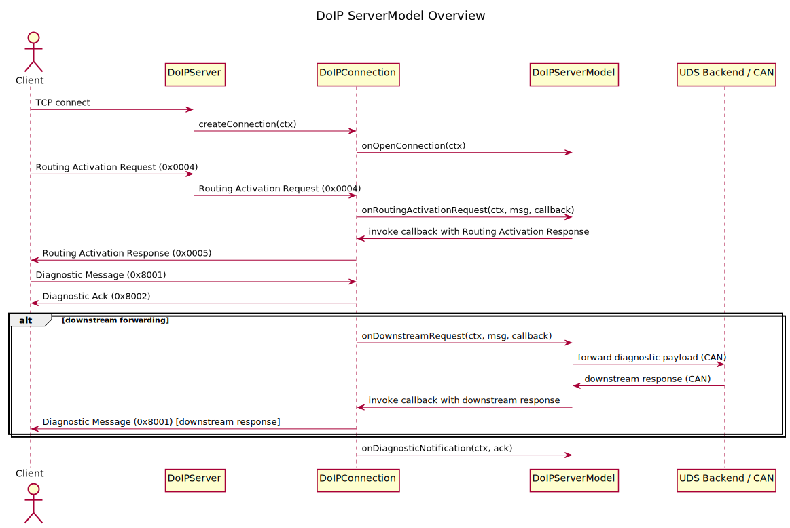

# Example DoIP Server Tutorial

This page describes how to build and run the example DoIP server included
with the libdoip project, and how to customize its UDS behavior.

## Overview

The example server application demonstrates a minimal DoIP server using
the library's `DoIPServer`, `DoIPConnection` and `DoIPServerModel` types.
The relevant example source files are located in the `examples/` directory:

- `examples/exampleDoIPServer.cpp` — program entry point and socket setup.
- `examples/ExampleDoIPServerModel.h` — example `DoIPServerModel` with
  ready-made UDS handlers and a small worker thread that simulates a
  downstream transport (e.g. CAN).

The example shows how to:

- Configure server properties (VIN, logical gateway address, announcement
  settings).
- Open UDP and TCP sockets for DoIP announcements and diagnostic
  connections.
- Register UDS handlers using the `uds::UdsMock` test helper for local
  request handling.

## Files of interest

- `inc/DoIPServerModel.h` — contains the `DoIPServerModel` callbacks that
  the application implements for connection-open, close and diagnostic
  message handling. Customize these callbacks to integrate your ECU logic.
- `examples/ExampleDoIPServerModel.h` — shows a concrete `DoIPServerModel`
  implementation used by the example server. UDS handlers are registered
  via `uds::UdsMock` and typed helpers such as
  `registerReadDataByIdentifierHandler`.
- `examples/exampleDoIPServer.cpp` — creates and configures a `DoIPServer`,
  sets logging level and starts listener threads that accept TCP
  connections.

### ServerModel interface (important callbacks)

The `DoIPServerModel` struct (see `inc/DoIPServerModel.h`) exposes a few
key callbacks your application implements. A concise summary:

- `onOpenConnection(IConnectionContext &ctx)` — called when a new connection
  is established.
- `onCloseConnection(IConnectionContext &ctx, DoIPCloseReason)` — called
  during graceful/abrupt close.
- `onDiagnosticMessage(IConnectionContext &ctx, const DoIPMessage &msg)` —
  called for locally-handled diagnostic messages.
- `onDownstreamRequest(IConnectionContext &ctx, const DoIPMessage &msg,
  ServerModelDownstreamResponseHandler cb)` — called when the state machine
  wants to forward a diagnostic request to a downstream transport (e.g.
  CAN). The implementation should return `DoIPDownstreamResult::Pending` if
  it will respond asynchronously and call `ctx.receiveDownstreamResponse()`
  when the response arrives.

Below is a minimal example implementation that forwards messages to a
hypothetical CAN backend and forwards the response to the connection
context.

```cpp
// inside your DoIPServerModel setup
m_model.onOpenConnection = [](IConnectionContext &ctx) noexcept {
    // Prepare per-connection state
};

m_model.onDownstreamRequest = [this](IConnectionContext &ctx, const DoIPMessage &msg,
                                    ServerModelDownstreamResponseHandler cb) noexcept {
    // Convert DoIP diagnostic payload to CAN frames and send
    auto [payload, size] = msg.getDiagnosticMessagePayload();
    ByteArray req(payload, payload + size);

    // Simulate async send to CAN; real code would push to a queue or
    // post to a worker thread that interacts with the hardware.
    canTransport.sendAsync(req, [&, cb, &ctx](const ByteArray &canRsp){
        // When response arrives, notify DoIP connection
        ctx.receiveDownstreamResponse(canRsp);
        // Optionally call provided callback to indicate handled
        if (cb) cb(canRsp, DoIPDownstreamResult::Handled);
    });

    return DoIPDownstreamResult::Pending;
};
```

## Building the example

The project uses CMake. From the repository root, run the following
commands to build the library and the examples (recommended with a clean
build directory):

```bash
rm -rf build
mkdir build
cd build
cmake .. -DCMAKE_BUILD_TYPE=Release -DWITH_EXAMPLES=ON
cmake --build . --parallel 4
```

On success the example binaries are available under `build/examples/`.

## Running the example server

The example executable is `exampleDoIPServer`. Run it from the build
directory, optionally enabling loopback mode (binds announcements to
127.0.0.1 instead of broadcast):

```bash
./examples/exampleDoIPServer [--loopback]
```

The program will:

- Configure the `DoIPServer` (VIN, logical address, announce interval).
- Open UDP and TCP sockets for announcements and incoming diagnostic
  connections.
- Start two threads: one that polls UDP announcements and one that waits
  for TCP connections and processes TCP messages.

## Customizing UDS behavior

The example registers default UDS services and a few typed handlers in
`ExampleDoIPServerModel`:

- Diagnostic Session Control (`0x10`) — registered via
  `m_uds.registerDiagnosticSessionControlHandler`.
- ECU Reset (`0x11`) — registered via
  `m_uds.registerECUResetHandler`.
- Read Data By Identifier (`0x22`) — registered via
  `m_uds.registerReadDataByIdentifierHandler`.
- Tester Present (`0x3E`) — registered via
  `m_uds.registerTesterPresentHandler`.

These typed helpers convert a raw diagnostic `ByteArray` request into
typed parameters (for example a DID or a session type) and forward the
request to the provided callback. The callback returns a pair of
`uds::UdsResponseCode` and a `ByteArray` payload. Implement your own
handlers to perform ECU-specific logic and return appropriate responses.

Example: register a handler for ReadDataByIdentifier to respond with a
VIN value for DID `0xF190`:

```cpp
m_uds.registerReadDataByIdentifierHandler([this](uint16_t did) {
    if (did == 0xF190) {
        ByteArray response = {...}; // data bytes: [DID hi, DID lo, data...]
        return std::make_pair(uds::UdsResponseCode::PositiveResponse, response);
    }
    return std::make_pair(uds::UdsResponseCode::RequestOutOfRange, ByteArray{0x22});
});
```

## Integrating a real downstream transport

The example uses `uds::UdsMock` to simulate downstream behavior. For a
real ECU you should implement `ServerModelDownstreamHandler` in
`DoIPServerModel::onDownstreamRequest` to forward diagnostic messages to
the physical bus (e.g., CAN) and call `ctx.receiveDownstreamResponse()`
when a response arrives. The state machine will handle timeouts and
transitions for you.

Simple downstream handler sketch:

```cpp
m_model.onDownstreamRequest = [this](IConnectionContext &ctx, const DoIPMessage &msg, ServerModelDownstreamResponseHandler cb) {
    // send msg to CAN
    // when response received: ctx.receiveDownstreamResponse(responseByteArray);
    return DoIPDownstreamResult::Pending;
};
```

## Diagram: ServerModel interactions

Below is a PlantUML diagram illustrating `DoIPServer`, `DoIPConnection`,
`DoIPServerModel` and a downstream UDS/CAN backend interaction.



## Logging and debugging tips

- The library uses `spdlog`. Set the log level early in `main`:

```cpp
doip::Logger::setLevel(spdlog::level::debug);
```

- Enable `--loopback` while testing locally to avoid network broadcast.
- If the example appears unresponsive, check that TCP sockets were
  successfully created. The example logs critical errors when socket
  setup fails.

## Troubleshooting common issues

- `exampleDoIPServer` exits immediately with critical log about sockets:
  - Ensure you have sufficient privileges to bind the requested ports.
  - Try running on loopback or using a system port range allowed by your
    OS.

- UDS handler not called:
  - Confirm the incoming diagnostic request is parsed correctly. Use the
    library logging to inspect raw message bytes.
  - If using downstream forwarding, ensure `onDownstreamRequest` is set
    and that the downstream transport calls back to
    `IConnectionContext::receiveDownstreamResponse`.

## Documentation / Doxygen

If you generate documentation with Doxygen, the file `doc/ExampleDoIPServer.md`
will be picked up automatically if `DOC_DIR` or the `INPUT` setting in
`Doxyfile` includes the `doc` directory. Run:

```bash
doxygen Doxyfile
```

After generation, look for the "Example DoIP Server Tutorial" page in
the generated HTML documentation.

## Message flow and payload types

This repository and the example server follow the DoIP payload conventions
used in the examples and tests. Important details to understand when
implementing or testing downstream forwarding:

- Incoming diagnostic requests from the client are sent as DoIP Diagnostic
  Messages (payload type 0x8001).
- Immediately after receiving a diagnostic message the DoIP server sends a
  Diagnostic Ack (payload type 0x8002) back to the client. This ack is sent
  regardless of whether the message will be handled locally or forwarded
  downstream. The ack acknowledges receipt at the DoIP transport level.
- If the server forwards the diagnostic request to a downstream transport
  (for example, CAN), it does so only for Diagnostic Messages (0x8001).
- When a downstream response arrives, the DoIP server sends that response
  back to the client as a Diagnostic Message (0x8001). That means the
  client may observe two DoIP messages for a single request: the
  Diagnostic Ack (0x8002) and later the downstream Diagnostic Message
  (0x8001) containing the actual UDS response.

ISO 13400 describes DoIP message and payload types. The immediate ack
behaviour is consistent with a transport-level acknowledgement: the server
confirms reception on the DoIP link while the actual diagnostic response
may be pending. If you require strict timing or synchronous behaviour, do
not rely on the ack as an application-level confirmation — always await
the downstream Diagnostic Message for the functional UDS response.

## Next steps

- Replace `uds::UdsMock` with a real UDS stack or backend for production.
- Extend the example model with additional UDS services as needed.
